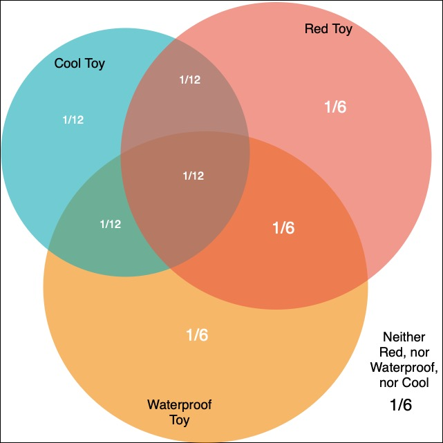

```{r setup, include=FALSE}
knitr::opts_chunk$set(echo = TRUE)
knitr::opts_chunk$set(fig.pos = 'H')
````

# 1) Gas Station Analytics
At a certain gas station, 40\% of customers use regular gas (event R), 35\% use mid-grade (event M), and 25\% use premium (event P).  Of the customers that use regular gas, 30\% fill their tanks (Event F).  Of the customers that use mid-grade gas, 60\% fill their tanks, while of those that use premium, 50\% fill their tanks.  Assume that each customer is drawn independently from the entire pool of customers.

GIVENS

$P(E_R)=.4, P(E_M)=.35, P(E_P)=.25$

$P(E_F|E_R)=.3$

$P(E_F|E_M)=.6$

$P(E_F|E_P)=.5$


## a) What is the probability that the next customer will request regular gas and fill the tank? e.g. $E_R$ and $E_F$?

Using the multiplication rule for conditional probability,
$$P(A \cap B) = P(B) \cdot P(A|B) = P(A) \cdot P(B|A) = P(B \cap A)$$

$P(E_R \cap E_F) = P(E_R) \cdot P(E_F | E_R) = (.4)(.3) = .12$

## b) What is the probability that the next customer will fill the tank? e.g. $E_F$?

Decomposing the probability of an event with partitioning
$$P(B) = P\big[ (A_1\cap B)\cup(A_2 \cap B) \cup \cdots \cup (A_N \cap B) \big] = \sum_{i=1}^N P(A_i \cap B) $$
Combined with the conditional probability rule
$$ P(B|A) = \frac{ P( A \cap B)  }{P(A)}   \iff P(A \cap B) = P(B|A) P(A) $$
Provides
$$ P(B) =\sum_{i=1}^N P(A_i \cap B) = \sum_{i=1}^N P(B|A_i) P(A_i) $$
So that

$P(E_F) = P(E_R \cap E_F) + P(E_M \cap E_F) + P(E_P \cap E_F)$

Solving for the above

$P(E_R \cap E_F) = .12$

$P(E_M \cap E_F) = P(E_M) \cdot P(E_F | E_M) = (.35)(.6) = .21$

$P(E_P \cap E_F) = P(E_P) \cdot P(E_F | E_P) = (.25)(.5) = .125$

$P(E_F) = .12 +.21 + .125 = .455$

## c) Given that the next customer fills the tank, what is the conditional probability that they use regular gas? e.g. What is the probability of $E_R$ given $E_F$?

Using the conditional probibility rule
$$P(B|A) = \frac{ P( A \cap B)  }{P(A)}$$

$P(E_R|E_F) = \frac{P(E_F \cap E_R)}{P(E_F)} = \frac{.12}{.455} = .2637$

# 2) The Toy Bin

 In a collection of toys, $1/2$ are red, $1/2$ are waterproof, and $1/3$ are cool. $1/4$ are red and waterproof.  $1/6$ are red and cool. $1/6$ are waterproof and cool. $1/6$ are neither red, nor waterproof, nor cool. Each toy has an equal chance of being selected.

GIVENS

$P(R)=\frac{1}{2}, P(W)=\frac{1}{2}, P(C)=\frac{1}{3}$

$P(R \cap W) = \frac{1}{4}, P(R \cap C)= \frac{1}{6}, P(W \cap C) = \frac{1}{6}$

$P(!R \cap !W \cap !C) = \frac{1}{6}$

$P(R \cup W \cup C) = 1 - P(!R \cap !W \cap !C) = 1 - \frac{1}{6} = \frac{5}{6}$

## a) Draw an area diagram to represent these events.

```{r, out.width = "50%", echo = FALSE, fig.cap="Venn diagram of Red Toys and Waterproof Toys and Cool Toys, oh my!", fig.align = "center"}


```
<center>Note that 1/6 is neither red, nor waterproof, nor cool, and is therefore outside of the Venn diagram</center>

## b) What is the probability of getting a red, waterproof, cool toy? e.g. $P(R \cap W \cap C)$

Using the addition rule, for any three events $A$, $B$, and $C$, 
$$P(A \cup B \cup C) = P(A) + P(B) + P(C) - P(A \cap B) - P(A \cap C) - P(B \cap C) + P(A \cap B \cap C)$$
$$P(R \cap W \cap C) = (1-P(!R \cap !W \cap !C)) -P(R) - P(W) - P(C) + P(R \cap W) + P(R \cap C) + P(W \cap C)$$  
$$ = (1- \frac{1}{6}) - \frac{1}{2} - \frac{1}{2} - \frac{1}{3} + \frac{1}{4} + \frac{1}{6} + \frac{1}{6}$$
$$ = \frac{1}{12}$$


## c) You pull out a toy at random and you observe only the color, noting that it is red.  Conditional on just this information, what is the probability that the toy is not cool? e.g. $P(!C | R)$

Using the multiplication rule,
$$P(A \cap B) = P(B) \cdot P(A|B)$$
and Bayes' rule, 
$$P(A|B) = \frac{P(B|A)P(A)}{P(B)}$$
and the Law of Total Probability,
$$P(B) = P(B|A) \cdot P(A) + P(B|!A) \cdot P(!A)$$


$$P(!C | R) =\frac{P(R|!C)P(!C)}{P(R)} \text {  Using Bayes' Rule}$$
$$=\frac{P(R)-P(R|C) \cdot P(C)}{P(R)} \text { Using Law of Total Probability}$$
$$=\frac{P(R)-P(R \cap C)}{P(R)} \text { Using Multiplication Rule}$$
$$=1-\frac{P(R \cap C)}{P(R)}=1-\frac{\frac{1}{6}}{\frac{1}{2}}=1-\frac{1}{3}=\frac{2}{3}$$

## d) Given that a randomly selected toy is red or waterproof, what is the probability that it is cool? e.g $P(C| R \cup W)$

$$P(C| R \cup W) = \frac{P(C \cap (R \cup W))}{P(R \cup W)}=\frac{P(C \cap R) + P(C \cap W)-P(C \cap R \cap W)}{P(R) + P(W)  - P(R \cap W)}$$
$$=\frac{\frac{1}{6}+\frac{1}{6}-\frac{1}{12}}{\frac{1}{2}+\frac{1}{2}-\frac{1}{4}}= \frac{\frac{1}{4}}{\frac{3}{4}}=\frac{1}{3}$$

# 3) On the Overlap of Two Events

Suppose for events A and B, $P(A) = 1/2$, $P(B) = 2/3$, but we have no more information about the events.

GIVENS

$P(A) = 1/2$, $P(B) = 2/3$

$$P(A \cap B) \leq P(A) \text{ and } P(A \cap B) \leq P(B)$$
$$P(A \cap B) \geq P(A) + P(B) - 1 \text{ from Boole's Inequality}$$

## a) What are the maximum and minimum possible values for $P(A \cap B)$?

$$max \{ P(A \cap B)\} = min \{P(A), P(B)\} = min \{\frac{1}{2}, \frac{2}{3}\} = 1/2$$

$$min \{ P(A \cap B)\} = P(A) + P(B) - 1 = \frac{1}{2}+\frac{2}{3}-1=1/6$$

## b) What are the maximum and minimum possible values for $P(A|B)$?

$$P(A|B)=\frac{P(A\cap B)}{P(B)}$$
$$max \{P(A|B) \} = \frac{max \{P(A\cap B)\}}{P(B)}  = \frac{\frac{1}{2}}{\frac{2}{3}}=3/4$$
$$min \{P(A|B) \} = \frac{min \{P(A\cap B)\}}{P(B)}  = \frac{\frac{1}{6}}{\frac{2}{3}}=1/4$$


# 4) Can't Please Everyone!
Among Berkeley students who have completed w203, $3/4$ like statistics.  Among Berkeley students who have not completed w203, only $1/4$ like statistics.  Assume that only 1 out of 100 Berkeley students completes w203.  Given that a Berkeley student likes statistics, what is the probability that they have completed w203?

GIVENS

$P(L|C)=3/4, P(L|!C)=1/4, P(C)=1/100$

$P(!C)=99/100$

$$P(C|L) = \frac{P(L|C) \cdot P(C)}{P(L)} \text{ (from Bayes' Rule)}$$
$$P(L) = P(L|C) \cdot P(C) + P(L|!C) \cdot P(!C) \text{ (from Law of Total Probability)}$$
$$P(C|L) = \frac{P(L|C) \cdot P(C)}{P(L|C) \cdot P(C) + P(L|!C) \cdot P(!C)} = \frac{\frac{3}{4} \cdot \frac{1}{100}}{\frac{3}{4} \cdot \frac{1}{100}+\frac{1}{4} \cdot \frac{99}{100}}=\frac{\frac{3}{400}}{\frac{102}{400}}=\frac{3}{102}=0.0294$$