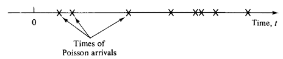

```{r setup, include=FALSE}
knitr::opts_chunk$set(echo = TRUE)
library(ggplot2)

```

## The Meat 

Suppose that Americans consume an average of 2 pounds of ground beef per month.

(a) Do you expect the distribution of this measure (ground beef consumption per capita per month) to be approximately normal? Why or why not?

\textbf{\underline{Answer:}}

>I do not expect the distribution to be normal when looking at the entire population. I expect the distribution might even have two peaks. One at 0 to account for all the vegans and vegetarians (you either eat meat or you don't) then sloping down sharply for a brief moment until rising again toward the average of around 2. I also expect the distribution to have a long right tail to account for fringes within our society who eat excessive amounts of meat. Definately no left tail. Because of these two conditions the distribution does not look normal. If we eliminated the  fringe zones and looked at a range instead (say .5 to 4.5), then the distribution would probably look normal (if the average really is 2).

(b) Suppose you want to take a sample of 100 people. Do you expect the distribution of the sample mean to be approximately normal? Why or why not?

\textbf{\underline{Answer:}}

>Yes, I expect the distribution of the sample mean to be normal. As I mentioned in the prior answer, if we were able to lop off the edges of the population the distribution would look more normal. With a sample size of 100, if we do get outliers they will be infrequent and the zero ground beef eaters will balance out the super beef eaters. Also, from what we know of the CLT, if we calculate a distribution on the sample mean it means we'll take n number of samples to generate the sample mean and as long as n > 30 we will get a normally distributed sample mean.

(c) You take a random sample of 100 Berkeley students to find out if their monthly ground beef consumption is any different than the nation at large.  The mean among your sample is 2.45 pounds and the sample standard deviation is 2 pounds. What is the 95\% confidence interval for Berkeley students?

\textbf{\underline{Givens:}}

>sample mean $\bar{X} = 2.45$
>
>sample standard deviation $s=2$
>
>sample size $n=100$
>
>population mean $\mu$
>
>The $100(1 - \alpha)\%$ confidence interval for $\mu$ is defined as 
>
>$$\bar{x}-t_{\frac{\alpha}{2},n-1} \cdot \frac{s}{\sqrt{n}}<\mu<\bar{x}+t_{\frac{\alpha}{2},n-1} \cdot \frac{s}{\sqrt{n}}$$

\textbf{\underline{Answer:}}

>For the 95\% confidence interval, $\alpha=.05$, and $df=n-1=99$
>
>$$\bar{x}-t_{.025,99} \cdot \frac{s}{\sqrt{n}}<\mu<\bar{x}+t_{.025,99} \cdot \frac{s}{\sqrt{n}}$$
>Looking up the value for $t_{.025}$ with $99$ df, $t_{.025,99} = 1.98$
>
>$$2.45-1.98 \cdot \frac{2}{10}<\mu<2.45+1.98 \cdot \frac{2}{10}$$
>$$2.054<\mu<2.846$$

## GRE Scores
Assume we are analyzing MIDS students' GRE quantitative scores. We want to construct a $95\%$ confidence interval, but we *naively* uses the famous 1.96 threshold as follows:

$$ \big( \bar{X} -1.96 \cdot \frac{s}{\sqrt{n}}, \big( \bar{X} +1.96 \cdot \frac{s}{\sqrt{n}} \big) $$

What is the real confidence level for the interval we have made, if the sample size is 10?  What if the sample size is 200? 

\textbf{\underline{Answer:}}

For $n=10$

>$100(1 - \alpha)\%$ is defined as the confidence interval
>
>At the 95\% confidence interval, $\alpha=.05$, and $df=n-1=9$
>
>Looking up the table value for $t_{\frac{\alpha}{2},n-1}$, $t_{.025,9} = 2.262$
>
>If $t_{\frac{\alpha}{2},9} = 1.96$ find out what the confidence interval $100(1-\alpha)$ really is (lets find $\alpha$).
>
>*Approach 1:* Use the t tables.
>
>Looking back at the tables, the next level down is $\alpha=0.05$ with $t_{.05,9} = 1.833$
>
>Difference between the two t values at df = 9 is $2.262 - 1.833 = 0.429$. This is also a difference in confidence interval of 5\%, going from 95\% to 90\%
>
>Going down in t values from $\alpha=0.05$ to the $\alpha$ we're looking for, $2.262 - 1.96 = 0.302$. The ratio is $0.302 / 0.429 = .70396$, so we're moving down $.025 * .70396 = 0.017599$
>
>the $\alpha$ we're looking for is $= 0.025 + 0.017599 = 0.042599 * 2 = 0.085198$
>
>100(1-.085198) = 91.48\%
>
>However, since the t-tables aren't linear we're probably off by a little bit. 
>
>*Approach 2:* Use R's pt() function to get the distribution at quantile q=1.96 with degrees of freedom df=9
>
```{r}
alpha <- 2 * (1-pt(1.96, df=9))
alpha
```
>
>Our linear approximation was close, but $\alpha = 0.0816$
>
>$100(1 -.0816) = $ 91.84\%


For $n=200$

```{r}
alpha <- 2 * (1-pt(1.96, df=199))
alpha
```
>
>$100(1 -.0514) = $ 94.86\%
>
>When $n$ is larger, the t-test approaches the 1.96 rule of thumb, and the approximation is fine.


## Maximim Likelihood Estimation for an Exponential Distribution

A Poisson process is a simple model that statisticians use to describe how events occur over time.  Imagine that time stretches out on the x-axis, and each event is a single point on this axis.



The key feature of a Poisson process is that it is *memoryless*.  Loosely speaking, the probability that an event occurs in any (differentially small) instant of time is a constant.  It doesn't depend on how long ago the previous event was, nor does it depend on when future events occur.  Statisticians might use a Poisson process (or more complex variations) to represent:

- The scoring of goals in a world cup match
- The arrival of packets to an internet router
- The arrival of customers to a website
- The failure of servers in a cluster
- The time between large meteors hitting the Earth

In live session, we described a Poisson random variable, a discrete random variable that represents the number of events of a Poisson process that occur in a fixed length of time.  However, a Poisson process can be used to generate other random variables.

Another famous random variable is the exponential random variable, which represents the time between events in a Poisson process.  For example, if we set up a camera at a particular intersection and record the times between car arrivals, we might model our data using an exponential random variable.

The exponential random variable has a well-known probability density function,

$$ f(x|\lambda) = \lambda e^{-\lambda x} $$

Here, $\lambda$ is a parameter that represents the rate of events.

Suppose we record a set of times between arrivals at our intersection, $x_1, x_2, ... x_n$.  We assume that these are independent draws from an exponential distribution and we wish to estimate the rate parameter $\lambda$ using maximum likelihood.

Do this using the following steps:

a. Write down the likelihood function, $L(\lambda)$.  Hint: We want the probility (density) that the data is exactly $x_1, x_2,...,x_n$.  Since the times are independent, this is the probability (density) that $X_1 = x_1$, times the probability (density) that $X_2 = x_2$, and so on.

\textbf{\underline{Answer:}}

>Since each $X_i$ is independent, 
>$$L(\lambda) = P(X_1 = x_1 \cap X_2 = x_2 \cap ... \cap X_n = x_x |\lambda) = P(X_1 = x_1|\lambda) P(X_2 = x_2|\lambda) \cdot\cdot\cdot P(X_n = x_n|\lambda)$$
>
>Substituting for $f(x|\lambda) = \lambda e^{-\lambda x}$,
>
>$$L(\lambda) = f(x_i, ... x_n | \lambda) = \prod_{i=1}^n \lambda e^{-\lambda x_i}$$
>$$= \lambda^n \prod_{i=1}^n e^{-\lambda x_i} = \lambda^n e^{-\lambda\sum\limits_{i=1}^n{x_i}}$$

b. To make your calculations easier, write down the log of the likelihood, and simplify it.

\textbf{\underline{Answer:}}

>$$\ln{L(\lambda)} = n \ln{\lambda} - \lambda \sum_{i=1}^{n}x_i$$

c. Take the derivative of the log of likelihood, set it equal to zero, and solve for $\lambda$.  How is it related to the mean time between arrivals?

\textbf{\underline{Answer:}}

>$$\frac{\partial {\ln{L(\lambda)}}}{\partial \lambda} = \frac{\partial}{\partial \lambda}(n\ln{\lambda}) - \frac{\partial}{\partial \lambda} (\lambda \sum_{i=1}^{n}x_i) = 0$$
>$$ \frac{n}{\lambda} - \sum\limits_{i=1}^n x_i = 0 $$
>$$ \lambda = \frac{n}{\sum\limits_{i=1}^n x_i} = \frac{1}{\bar{X}}$$
>Lambda is 1 over the sample mean.

d. Suppose you get the following vector of times between cars:

```{r}
times = c(2.65871285, 8.34273228, 5.09845548, 7.15064545,
          0.39974647, 0.77206050, 5.43415199, 0.36422211,
          3.30789126, 0.07621921, 2.13375997, 0.06577856,
          1.73557740, 0.16524304, 0.27652044)
```

Use R to plot the likelihood function.   Then use optimize to approximate the maximum likelihood estimate for $\lambda$.  How does your answer compare to your solution from part c?

\textbf{\underline{Answer:}}

```{r}
# Let's graph the log of likelihood function first
log_likelihood_func <- function(lambda) {
    n<-length(times)
    return(n*log(lambda)-lambda*sum(times))
}
#options(repr.plot.height = 2, repr.plot.width = 8, repr.plot.pointsize = 20)

p = seq(0,3,.001)
qplot(p,log_likelihood_func(p), geom = 'line', 
      main = 'Log of Likelihood as a Function of Lambda', 
      xlab = 'Lambda',  ylab = 'Log of Likelihood')
```

```{r}
optimize(log_likelihood_func, interval=c(0,3), maximum=T)

1/mean(times)

```

>The maximum likelihood for lambda is $0.3949192$ which is also equal to 1 over the sample mean, which we saw in c).


```{r}
# Try it again using the likelihood function
likelihood_func <- function(lambda) {
    n<-length(times)
    return(lambda^n * exp(-lambda * sum(times)))
}

#options(repr.plot.height = 10, repr.plot.width = 15, repr.plot.pointsize = 32)
library(ggplot2)

p = seq(0,1,.001)
qplot(p,likelihood_func(p),
      geom = 'line',
      main = 'Likelihood as a Function of Lambda',
      xlab = 'Lambda',
      ylab = 'Likelihood')
```

```{r}
optimize(likelihood_func, interval=c(0,3), maximum=T)

log(optimize(likelihood_func, interval=c(0,3), maximum=T)$objective)

```
>Same lambda as before $0.3949192$ which is also equal to 1 over the sample mean.