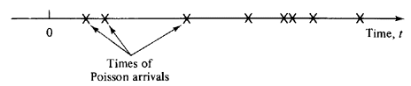

```{r setup, include=FALSE}
knitr::opts_chunk$set(echo = TRUE)
```
 
## The Meat 

Suppose that Americans consume an average of 2 pounds of ground beef per month.

(a) Do you expect the distribution of this measure (ground beef consumption per capita per month) to be approximately normal? Why or why not?

Although it is very hard to generalize, most variables we come across in the social sciences deviate substantially from a normal distribution.  In particular, we might expect this variable to have a point mass at zero, representing vegetarians and others who eat zero beef.  We might also expect that some americans eat many times the national average (e.g. competitive eaters) which would appear as a positive skew.  The fact that the variable is non-negative also suggests that it may be positively skewed.  For a non-negative variable to be approximately normal, the standard deviation would have to be quite a bit smaller than the mean.  Otherwise, if you imagine a normal distribution centered around 2 pounds, a substantial part of the left tail would be cut off at zero.

(b) Suppose you want to take a sample of 100 people. Do you expect the distribution of the sample mean to be approximately normal? Why or why not?

It should be approximately normal.  According to the Central Limit Theorem, as long as n is sufficiently large (the rule of thumb is that n should be > 30), then the distribution of the sample mean will have an approximately normal distribution.  (As we're seen in class, there are times in which $n=30$ may not be enough for the CLT to work, but there is little to suggest that this particular variable would display unusually large skew.) 

(c) You take a random sample of 100 Berkeley students to find out if their monthly ground beef consumption is any different than the nation at large.  The mean among your sample is 2.45 pounds and the sample standard deviation is 2 pounds. What is the 95\% confidence interval for Berkeley students?

Since we are estimating the population standard deviation from the sample standard deviation, it is appropriate to use the t-distribution.

$$\bar{X}-t_{.975,99} \cdot \frac{\sigma_{\bar{X}}}{\sqrt{n}}<\mu<\bar{X}+t_{.975,99} \cdot \frac{\sigma_{\bar{X}}}{\sqrt{n}}$$
$$2.45-1.98 \cdot \frac{2}{10}<\mu<2.45+1.98 \cdot \frac{2}{10}$$
A 95% confidence interval of $2.053<\mu<2.847$


## GRE Scores
Assume we are analyzing MIDS students' GRE quantitative scores. We want to construct a $95\%$ confidence interval, but we *naively* uses the famous 1.96 threshold as follows:

$$ \big( \bar{X} -1.96 \cdot \frac{s}{\sqrt{n}},  \bar{X} +1.96 \cdot \frac{s}{\sqrt{n}} \big) $$

What is the real confidence level for the interval we have made, if the sample size is 10?  What if the sample size is 200? 

The confidence interval, especially for n<30, should really be based on the t-distribution:
$$ \big( \bar{X} - t_{\frac{\alpha}{2},n-1}\cdot \frac{s}{\sqrt{n}}, \bar{X} +t_{\frac{\alpha}{2},n-1}\cdot \frac{s}{\sqrt{n}} \big) $$

So, for n = 10, the interval given *naively* would need a t-value equal to 1.96.  That is, we need $\alpha$ such that $t_{\frac{\alpha}{2},n-1} = 1.96$.  The point on the left tail that yields this value is given by

```{r}
pt(-1.96, df=10-1)
```

To find the corresponding $\alpha$, we have to multiply this by 2.

```{r}
2 * pt(-1.96, df=10-1)
```

Which means the confidence interval, given by $100(1-\alpha)$, is really  a 91.83% confidence interval.

For an n of 200, the central limit theorem implies that the *naively* used formula would be a very good approximation to the 95% confidence interval. This can be checked by forllowing the same procedure for n=200, which gives a 94.86% confidence interval for a t-value of 1.96.


## Maximim Likelihood Estimation for an Exponential Distribution

A Poisson process is a simple model that statisticians use to describe how events occur over time.  Imagine that time stretches out on the x-axis, and each event is a single point on this axis.



The key feature of a Poisson process is that it is *memoryless*.  Loosely speaking, the probability that an event occurs in any (differentially small) instant of time is a constant.  It doesn't depend on how long ago the previous event was, nor does it depend on when future events occur.  Statisticians might use a Poisson process (or more complex variations) to represent:

- The scoring of goals in a world cup match
- The arrival of packets to an internet router
- The arrival of customers to a website
- The failure of servers in a cluster
- The time between large meteors hitting the Earth

In live session, we described a Poisson random variable, a discrete random variable that represents the number of events of a Poisson process that occur in a fixed length of time.  However, a Poisson process can be used to generate other random variables.

Another famous random variable is the exponential random variable, which represents the time between events in a Poisson process.  For example, if we set up a camera at a particular intersection and record the times between car arrivals, we might model our data using an exponential random variable.

The exponential random variable has a well-known probability density function,

$$ f(x|\lambda) = \lambda e^{-\lambda x} $$

Here, $\lambda$ is a parameter that represents the rate of events.

Suppose we record a set of times between arrivals at our intersection, $x_1, x_2, ... x_n$.  We assume that these are independent draws from an exponential distribution and we wish to estimate the rate parameter $\lambda$ using maximum likelihood.

Do this using the following steps:

a. Write down the likelihood function, $L(\lambda)$.  Hint: We want the probility (density) that the data is exactly $x_1, x_2,...,x_n$.  Since the times are independent, this is the probability (density) that $X_1 = x_1$, times the probability (density) that $X_2 = x_2$, and so on.

    $$L(\lambda) = f(x_i, ... x_n | \lambda) = \prod_{i=1}^n \lambda e^{-\lambda x_i} = \lambda^n e^{-\lambda\sum{x}}$$
    
    
b. To make your calculations easier, write down the log of the likelihood, and simplify it.
    $$\ln{L(\lambda)} = n \ln{\lambda} - \lambda \sum_{i=1}^{n}x$$


c. Take the derivative of the log of likelihood, set it equal to zero, and solve for $\lambda$.  How is it related to the mean time between arrivals?

    $$\frac{\partial {\ln{L(\lambda)}}}{\partial \lambda} = \frac{\partial}{\partial \lambda}(n\ln{\lambda}) - \frac{\partial}{\partial \lambda} (\lambda \sum_{i=1}^{n}x) = 0$$
    $$ \frac{n}{\lambda} - \sum_i^n x = 0 $$
    $$ \lambda = \frac{n}{\sum x}$$
    $\lambda_{mle}$ is the inverse of the mean time between arrivals $\bar{X}$.
    

d. Suppose you get the following vector of times between cars:

```{r}
times = c(2.65871285, 8.34273228, 5.09845548, 7.15064545,
          0.39974647, 0.77206050, 5.43415199, 0.36422211,
          3.30789126, 0.07621921, 2.13375997, 0.06577856,
          1.73557740, 0.16524304, 0.27652044)
```

Use R to plot the likelihood function. Then use optimize to approximate the maximum likelihood estimate for $\lambda$. How does your answer compare to your solution from part c?
```{r}
loglikelihood=function(l){
  length(times)*log(l)-l*sum(times)
}
lambda=seq(0,5,.01)
plot(loglikelihood,lambda,xlim=c(0,5),xlab='Lambda',main="Log Likelihood versus Lambda")

optimize(loglikelihood,interval=c(0,5), maximum=T)

length(times)/sum(times)

```


```{r}

likelihood<-function(l, x) l^length(x) * exp(-l * sum(x))
library(ggplot2)
ggplot(data.frame(l=seq(0, 1, 0.01)), aes(l)) +
    stat_function(fun=function(l) likelihood(l, times)) + 
    ylab('Likelihood') + xlab(expression(lambda)) +
    ggtitle(expression(Plot~of~likelihood~vs~lambda))

optimize(function(l) likelihood(l, times), interval=c(0, 1), maximum=T)
1/mean(times)
```

The optimize function and the equation derived in part c give almost identical answers!
